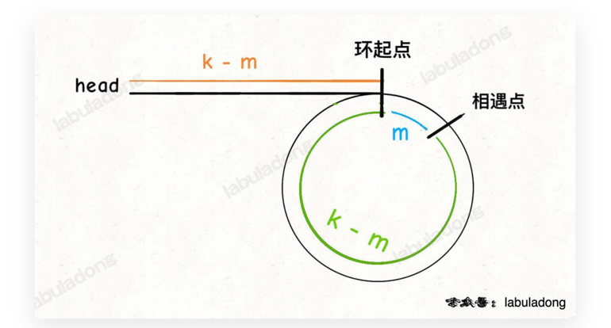

假设快慢指针相遇时，慢指针走了k步，那么快指针走了2k步。
快指针比慢指针多走了k步，这k步一定是在环内转圈圈，所以
k是环的整数倍。  

再假设相遇点距离环的起点m步，那么环的起点与头节点的距离
为k-m，也就是说从头节点走k-m步就能到达环的起点。巧的是，
从相遇点继续向前走k-m也能到达环起点。  
所以我们只用在快慢指针相遇后，将快指针或慢指针拨回头节点，
再让快慢指针以相同的速度前进，k-m步后2个指针一定会相遇，
相遇的节点就是环的起点